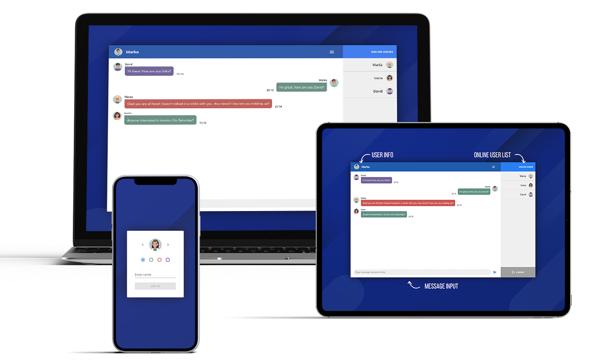

# Getting Started with Chat App

Simple and easy to use Chat App, developed in React with [Scaledrone API](https://www.scaledrone.com/).\
App uses [Redux](https://redux.js.org/) for centralized component state management and [Material UI](https://mui.com/) components.\
Users connect by first entering Name/Nickname and picking one of the six available avatars and background colors.\
After connecting user can see other online users, type new message and send with press of the "enter" button or simply by clicking "send" button on UI. After chatting with friends, user can simply logout via button.
Check live preview [click here](https://btopolnjak.github.io/react-day-planner-app/) and happy chatting!

## Available Scripts for Developers

In the project directory, you can first run:

#### `npm install`

To install all project dependancies and then:

#### `npm start`

To runs the app in the development mode.\
Open [http://localhost:3000](http://localhost:3000) to view it in your browser.

The page will reload when you make changes.\
You may also see any lint errors in the console.

## Links

- Website - [Boris Topolnjak](https://github.com/btopolnjak)
- LinkedIn - [@boris-topolnjak](https://www.linkedin.com/in/boris-topolnjak-23334b104/)
